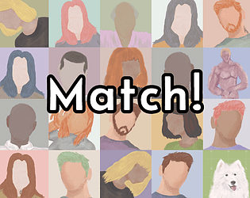

# Match !
Created in **48H** for the **GMTK Game Jam 2023** by [Bigaston](https://bigaston.itch.io) and [Nyeut](https://nyeut.itch.io)

In Match! you play as a micro worker who works for the new Dating App that everyone use. "It's so perfect! You match only with perfect people" said the ad.

Why? Because all the matchs are selected by you, a human, that need to understand the loving profile of your user.

Available on [itch.io](https://bigaston.itch.io/match)

Assets used:
- https://kenney.nl/assets/ui-pack
- https://kenney.nl/assets/ui-audio
- https://kenney.nl/assets/game-icons
- S'hill - Feel (creative common license): https://www.youtube.com/watch?v=JnY583NIAmc
